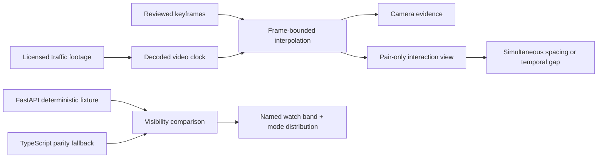

# Vector Field — Real Footage Pair Review

[](https://marinjursic.github.io/autonomous-motion-forecasting-lab/)
[](https://github.com/MarinJursic/autonomous-motion-forecasting-lab/actions/workflows/pages.yml)

Vector Field is a real-footage review surface for understanding which road-user
curated pair is under review, where its camera-plane traces approach, and how a controlled visibility
assumption changes a deterministic motion fixture. It replaces a dense
dashboard of layers and synthetic scorecards with one three-step workflow:
watch the evidence, read the interaction, and test one assumption.

> **Research interface, not a driving system.** The clips are real and locally
> bundled. Boxes and traces are demonstration annotations reviewed for this
> repository. The interaction map uses normalized camera coordinates—not
> calibrated world geometry—and the deterministic score is not a safety
> probability.

## Continuous application walkthrough

[](docs/walkthrough/app-walkthrough.mp4)

[Open the full-resolution MP4](docs/walkthrough/app-walkthrough.mp4) ·
[Open the poster frame](docs/walkthrough/app-walkthrough-poster.jpg)

The walkthrough is a continuous capture of the application itself. It moves from
the real Gaithersburg intersection record to the real Market Street clip, changes
the focal member of the curated pair, and opens the controlled visibility
comparison. The footage and image-plane relationship stay synchronized throughout.

## Why the interface is structured this way

Official autonomous-driving datasets separate visual evidence from spatial
reasoning:

- [Waymo Occupancy Flow Fields](https://waymo.com/research/occupancy-flow-fields-for-motion-forecasting-in-autonomous-driving/)
  combines occupancy with motion direction instead of treating a heatmap as
  sufficient context.
- [Argoverse 2 motion forecasting](https://argoverse.github.io/user-guide/tasks/motion_forecasting.html)
  designates focal and scored tracks, represents histories as time-indexed
  positions, headings, and velocities, and pairs scenarios with local maps.
- [Argoverse 2 maps](https://argoverse.github.io/user-guide/argoverse_2.html)
  distinguish semantic lane and crossing geometry from sensor evidence.
- The [nuScenes prediction task](https://github.com/nutonomy/nuscenes-devkit/blob/master/python-sdk/nuscenes/eval/prediction/README.md)
  evaluates multiple candidate x/y trajectories with explicit probabilities.
- [Euro NCAP car-to-car protocols](https://www.euroncap.com/safety-assist/)
  define safety measurements only within controlled test conditions. This app
  therefore does **not** show a fabricated TTC value from uncalibrated internet
  video.
- The [FHWA Surrogate Safety Assessment Model](https://highways.dot.gov/turner-fairbank-highway-research-center/software/ssam)
  operates on detailed vehicle-trajectory records; this interface keeps its
  uncalibrated camera traces visibly separate from physical safety measures.
- [NHTSA crash-warning human-factors guidance](https://www.nhtsa.gov/document/crash-warning-system-interfaces-human-factors-insights-and-lessons-learned-0)
  documents the comprehension benefit of a simpler single-stage mental model.
  Vector Field is not an in-vehicle warning, but the same restraint motivates
  its one analytical action instead of a wall of caution controls.

Vector Field applies those conventions conservatively. The left panel remains
the visual source of truth. The right panel reduces reviewed keyframes to a
pair-only image-plane diagram, clearly labels simultaneous versus
time-separated tracks, and reports either closest image-plane trace spacing or
the gap between annotation windows.

## Three real-world review cases

| Scenario | Primary pair | What the UI asserts | Source |
|---|---|---|---|
| **Market Street, San Francisco** | cyclist `cyc-12` + taxi `taxi-73` | reviewed windows overlap near the center corridor; review candidate only | Editor · [CC BY 3.0](https://commons.wikimedia.org/wiki/File:Street_traffic.webm) |
| **MD-355 / MD-124, Gaithersburg** | sedan `veh-101` + crossover `veh-204` | a time-separated same-corridor control; no near-collision claim | G. Edward Johnson · [CC BY 4.0](https://commons.wikimedia.org/wiki/File:MD-355_and_MD-124_Gaithersburg_MD_2022-07-30_11-07-03_1.webm) |
| **Cologne, Germany** | vehicle `veh-08` + vehicle `veh-19` | two curated low-light tracks overlap in time; no automatic collision classification | Maximilian Schönherr · [CC BY-SA 4.0](https://commons.wikimedia.org/wiki/File:Cars_Passing_by_at_Night.webm) |

Each source was trimmed, resized to 1280×720, transcoded to local 30 fps VP9
WebM and H.264 MP4 derivatives, and paired with an HD poster. No vehicles, cyclists, roads, or background
content were generated or composited. Attribution and transformation details
are in [THIRD_PARTY_NOTICES.md](THIRD_PARTY_NOTICES.md).

## The three-step review

### 1. Watch the evidence

- The actual decoded video clock is read with `requestVideoFrameCallback`.
- Only the two primary tracks are shown by default; optional contextual tracks
  require one explicit toggle.
- Play, pause, scrub, and `0.5×` / `1×` / `1.5×` playback remain synchronized
  with frame-bounded boxes.
- Selecting a box makes that record focal without opening another dashboard.
- The source creator and license stay next to the footage.

### 2. Read the interaction

The evidence-derived image-plane relationship is generated from the same
reviewed keyframes that drive the camera boxes. It contains no vehicle
illustrations, invented road model, coordinate axes, or projected-world claim.
Colored traces, keyframe samples, current positions, and the closest reviewed
relationship make the pair legible at a glance.

For simultaneously visible tracks, the app samples the common review interval
and marks the visually closest reviewed moment without exposing a physical
distance. If the windows do not overlap, it says so directly. This is a curated
review aid, not an automatic collision determination.

### 3. Test one assumption

The only analytical action is a controlled visibility comparison:

```text
visibility context ∈ {recorded, improved, unobstructed fixture}
```

The current real scenario ID, focal reviewed actor ID, and intervention are sent
to the FastAPI evidence endpoint. The footage, keyframes, horizon, seed (`42`),
and sample count (`128`) remain fixed. If the API is unavailable, the TypeScript
fallback uses the matching unsigned 32-bit generator and allocation rules.

The response updates the named watch band and continue/yield/deviate
distribution. The application does not edit the video, infer physical
separation, or claim a validated collision probability.

## Interaction model



| Layer | Responsibility |
|---|---|
| `app/components/MotionLab.tsx` | three-step workflow, video synchronization, pair focus, accessibility, themes, comparison |
| `app/lib/scenarios.ts` | provenance, reviewed keyframes, pair definitions, interpolation, relationship derivation |
| `app/lib/motion-domain.ts` | typed API client and byte-matching deterministic fallback |
| `backend/app/engine.py` | seeded multimodal allocation and transparent risk fixture |
| `backend/app/schemas.py` | strict request and response contracts |
| `backend/app/adapters.py` | validated normalized mapping seams for separately obtained Waymo or CARLA input |

## Run locally

Prerequisites: Node.js `22.13+` and Python `3.11+`.

```bash
npm install
python3 -m venv backend/.venv
backend/.venv/bin/python -m pip install -r backend/requirements.txt
```

Start the optional API:

```bash
npm run api
```

Start the web application in another terminal:

```bash
npm run dev
```

All footage, pair selection, transport, scenario, source, theme, and
interaction-map behavior works without the API. The controlled comparison uses
the parity fallback when the API is unavailable.

## API

| Method | Path | Purpose |
|---|---|---|
| `GET` | `/health` | readiness and active engine |
| `GET` | `/api/scenarios/{id}` | typed actors, map features, and coordinate frame |
| `POST` | `/api/forecast` | multimodal trajectories, covariance, entropy, OOD proxy, and risk fixture |
| `POST` | `/api/evidence-counterfactual` | active real clip + reviewed actor + controlled visibility intervention |
| `POST` | `/api/counterfactual` | coordinate-contract compatibility adapter |
| `GET` | `/api/metrics` | synthetic test metrics with explicit provenance |

Example:

```bash
curl -s http://127.0.0.1:8000/api/evidence-counterfactual \
  -H 'content-type: application/json' \
  -d '{
    "scenario_id": "market",
    "actor_id": "cyc-12",
    "intervention": "removed",
    "horizon_s": 3,
    "samples": 128,
    "seed": 42
  }'
```

## Verification

```bash
npm run verify
```

The gate covers production builds, strict TypeScript, ESLint, responsive and
theme contracts, three valid local WebM files and HD posters, frame-bounded
interpolation, pair integrity, derived closest relationships, synchronized
video controls, deterministic browser/API parity, typed HTTP errors, FastAPI
schemas, seeded covariance and probability behavior, and adapter validation.

## Accuracy boundaries

- The image-plane relationship is not a homography, HD map, physical scene
  reconstruction, or world-coordinate frame.
- Trace spacing is percentage-of-frame distance and must not be interpreted as
  meters.
- The clips do not contain benchmark ground truth; the boxes are reviewed
  demonstration annotations.
- The qualitative review band is an authored deterministic UI fixture, not a
  calibrated safety probability.
- No TTC is computed because the media lacks the calibration and controlled
  conditions needed to make it defensible.
- No planning, control, or actuation output is produced.
- Production use requires licensed sensor data, calibrated geometry, evaluated
  perception and forecasting models, probability calibration, rare-event
  testing, and formal safety review.

## Repository map

```text
app/components/MotionLab.tsx  footage + pair-first review workflow
app/lib/scenarios.ts          real clips, provenance, tracks, pair analysis
app/lib/motion-domain.ts      typed fixture and API client
backend/app/                  FastAPI schemas, engine, endpoints, adapters
public/scenarios/             three licensed real-world WebM clips and posters
docs/walkthrough/             continuous MP4, GIF preview, and poster
tests/                        media, pair, UI contract, rendering, and parity tests
THIRD_PARTY_NOTICES.md        media attribution and transformation record
```

No source-code license has been selected; copyright remains with the repository
owner. Third-party traffic footage remains under the licenses recorded in
[THIRD_PARTY_NOTICES.md](THIRD_PARTY_NOTICES.md).
