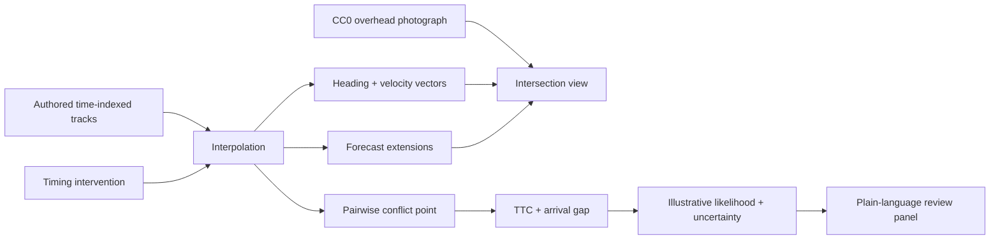

# Crossing Lab

[](https://marinjursic.github.io/CrossingLab/)
[](https://github.com/MarinJursic/CrossingLab/actions/workflows/pages.yml)

Crossing Lab explains one potential intersection conflict from an elevated
view. A real CC0 photograph remains the visual source of truth while a compact,
authored motion fixture makes direction, speed, predicted path, pairwise
conflict timing, TTC, uncertainty, and simple timing interventions easy to read.

The interface has one sequence:

```text
Watch the three tracks → understand the conflict → test a timing change
```

> **Research interface, not a crash detector.** The photograph is real. The
> tracks, velocities, confidence values, TTC, and collision-likelihood score are
> authored demonstration data. They were not inferred from the single image and
> must not be used for roadway, vehicle, or safety decisions.

## Application walkthrough

[](docs/walkthrough/app-walkthrough.mp4)

[Open the full-resolution MP4](docs/walkthrough/app-walkthrough.mp4) ·
[Open the poster frame](docs/walkthrough/app-walkthrough-poster.jpg)

The walkthrough media is captured from the running application. A release
capture should show the full Watch → Conflict → Test sequence, including actor
selection, the likelihood uncertainty band, early braking, protected-turn
timing, the replay action, and both themes.

## What makes the example understandable

The screen deliberately separates evidence from explanation:

- The background is a 1920×1280 elevated photograph of a real Vancouver
  intersection by Ferdinand Stöhr, dedicated under CC0.
- Solid colored paths show authored track history.
- Dotted extensions show each track’s constant-motion fixture forecast.
- An arrow at every actor communicates heading and velocity.
- The shared conflict point is labeled directly on the road surface.
- Both actors list their time-to-conflict and authored arrival time side by
  side.
- The collision-likelihood percentage always says **illustrative**, includes a
  ± uncertainty range, and is followed by a plain-language explanation.
- The Test step changes only the turning vehicle’s arrival timing, so the
  counterfactual is easy to compare.

The pedestrian is context rather than part of the primary vehicle pair and can
be hidden with a single checkbox.

## Why these measures are shown

The interaction model follows conventions from primary transportation and
motion-forecasting sources:

- [FHWA’s Surrogate Safety Assessment Model](https://highways.dot.gov/turner-fairbank-highway-research-center/software/ssam)
  evaluates conflicts from detailed trajectory records and defines a conflict
  as a situation in which users are likely to collide without evasive action.
- [FHWA’s foundational surrogate-measures report](https://highways.dot.gov/sites/fhwa.dot.gov/files/FHWA-RD-03-050.pdf)
  treats conflict points, TTC, post-encroachment time, speed differential, and
  deceleration as surrogate measures—not substitutes for observed crash data.
- [Argoverse 2 motion forecasting](https://argoverse.github.io/user-guide/tasks/motion_forecasting.html)
  represents actor state with time-indexed position, heading, and instantaneous
  x/y velocity, and explicitly distinguishes focal, scored, and contextual
  tracks.
- [Waymo Occupancy Flow Fields](https://waymo.com/research/occupancy-flow-fields-for-motion-forecasting-in-autonomous-driving/)
  combines occupancy with motion direction; Crossing Lab similarly keeps
  direction visible instead of presenting a risk heatmap alone.
- [NHTSA’s intersection collision-avoidance research](https://www.nhtsa.gov/crash-avoidance/office-crash-avoidance-research-technical-publications)
  uses controlled test procedures for crossing-path scenarios. Because this
  portfolio example lacks calibrated sensors and test-track ground truth, its
  percentage is explicitly illustrative rather than presented as calibrated.

## The authored fixture

### Road users

| Track | Role | Recorded fixture speed | Confidence |
|---|---|---:|---:|
| `V-21` | southeast through vehicle | 12.6 m/s · 45 km/h | 96% |
| `V-08` | northbound turning vehicle | 8.4 m/s · 30 km/h | 93% |
| `P-04` | crosswalk context pedestrian | 1.4 m/s · 5 km/h | 88% |

Confidence here is fixture metadata used to demonstrate a review interface. It
is not a perception-model result.

### Conflict calculation

For the recorded-flow fixture:

```text
V-21 conflict arrival = 4.25 s
V-08 conflict arrival = 4.48 s
arrival gap           = 0.23 s
```

At the default review time of 2.45 seconds, TTC is 1.80 seconds for `V-21`
and 2.03 seconds for `V-08`. These are remaining times along the authored
image-plane tracks, not photogrammetric measurements.

The demonstration likelihood uses an intentionally small, inspectable formula:

```text
illustrative likelihood = round(52 × exp(-0.9 × arrival_gap))
```

The UI attaches an authored uncertainty band of ±9 percentage points to the
observed fixture, ±6 to early braking, and ±3 to the protected-turn example.
The formula exists to make UI states deterministic; it has not been fitted,
calibrated, or validated against crash outcomes.

### Timing comparisons

| Control | Turning-vehicle arrival | Purpose |
|---|---:|---|
| Observed flow | 4.48 s | baseline authored encounter |
| Early brake | 5.62 s | show how earlier deceleration separates arrivals |
| Protected turn | 7.10 s | show a separate phase after the through path clears |

Selecting a control immediately updates the trajectory, turning-vehicle speed,
TTC, gap, likelihood, uncertainty, and plain-language result. “Replay this
timing” restarts the complete eight-second fixture with the selected control.

## Interaction inventory

Every visible control changes an observable state:

| Control | Result |
|---|---|
| Watch / Conflict / Test | switches the explanation and sets a useful playhead state |
| Light / Dark | persists the selected theme locally |
| Pedestrian context | shows or hides `P-04` |
| Actor on image or in list | changes the velocity and heading readout |
| Play / Pause | starts or stops the fixture clock |
| Timeline | seeks to an exact fixture time and pauses |
| Restart | resets to 0 seconds and plays |
| Observed / Early brake / Protected turn | reruns the deterministic timing comparison |
| Test a safer timing | advances from the conflict explanation to Test |
| Replay this timing | restarts the selected comparison |

Keyboard focus, Enter/Space activation on SVG actors, status announcements,
responsive layouts, reduced-motion behavior, and light/dark palettes are
included.

## Architecture



| Layer | Responsibility |
|---|---|
| `app/components/MotionLab.tsx` | three-step workflow, clock, controls, themes, SVG interaction, accessible status |
| `app/lib/overhead-scenario.ts` | source provenance, actors, interpolation, heading, forecasts, TTC, deterministic comparison |
| `public/scenarios/vancouver-overhead.jpg` | bundled 1920×1280 CC0 source photograph |
| `tests/overhead-scenario.test.mjs` | image integrity, pair timing, intervention ordering, velocity and path contracts |
| `backend/app/` | optional typed FastAPI research fixtures retained for extension work |

## Run locally

Prerequisites: Node.js `22.13+` and Python `3.11+`.

```bash
npm install
python3 -m venv backend/.venv
backend/.venv/bin/python -m pip install -r backend/requirements.txt
npm run dev
```

The overhead application is fully local and does not require the Python API.
The API can still be started separately for research extensions:

```bash
npm run api
```

## Verification

```bash
npm run verify
```

The gate covers the production build, strict TypeScript, ESLint, server-rendered
HTML, source-media dimensions, actor taxonomy, shared conflict geometry,
TTC/arrival values, intervention ordering, heading and forecast output,
WCAG AA palette contrast, DOM-level interaction of every workflow control, the
legacy deterministic browser/API parity layer, FastAPI schemas, and backend
tests.

## Accuracy boundaries

- The background is a single elevated photograph, not a calibrated overhead
  camera feed or orthorectified map.
- SVG positions are image coordinates. Distance is not measured in meters.
- Tracks, boxes, velocity, heading, confidence, arrival time, TTC, risk, and
  uncertainty are authored fixtures.
- The likelihood is not statistically calibrated and is not a probability of a
  crash in the photographed scene.
- The intervention comparison changes an authored arrival schedule; it does not
  simulate braking dynamics or a traffic controller.
- No detection, tracking, forecasting, planning, warning, or actuation model is
  deployed.
- Production use requires calibrated multi-frame sensing, evaluated tracking,
  map alignment, probability calibration, rare-event validation, safety
  engineering, and applicable regulatory review.

Attribution and derivative details are recorded in
[THIRD_PARTY_NOTICES.md](THIRD_PARTY_NOTICES.md).

No source-code license has been selected; copyright remains with the repository
owner. Third-party media remains under the terms recorded in the notice file.
