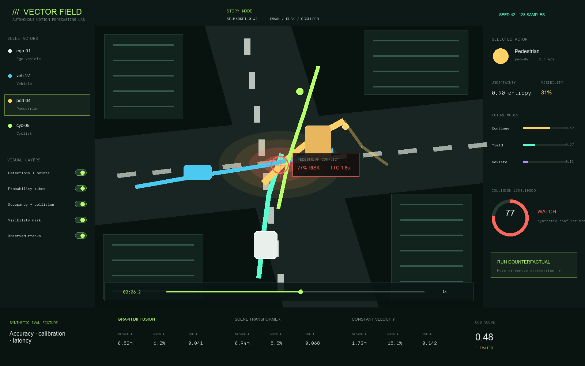
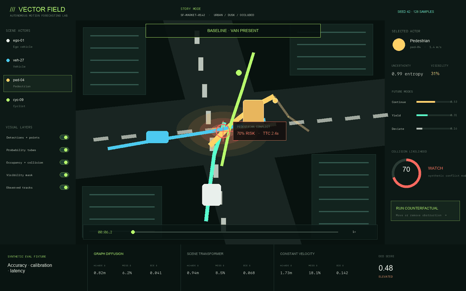
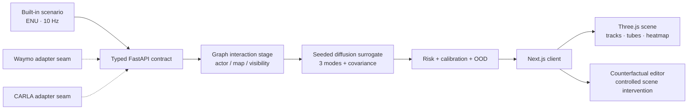

# Vector Field — Autonomous Motion Forecasting Laboratory

An interactive, dataset-free laboratory for inspecting multimodal motion forecasts, occupancy risk, occlusion uncertainty, and controlled counterfactuals in autonomous-driving scenes.



**Laboratory overview.** The selected pedestrian is partially hidden by the delivery van. Colored forecast tubes show mutually exclusive futures, the warm occupancy field marks the ego–pedestrian conflict region, and the right rail exposes the probabilities and visibility used by the deterministic risk model.

<p align="center">
  
</p>

**Counterfactual showcase.** The animation keeps the map, actors, intent, horizon, sample count, and seed fixed while moving one obstruction. Watch the visibility, future-mode probabilities, occupancy field, TTC, and risk update together.

> **Portfolio research prototype, not a driving system.** The shipped model is a deterministic, auditable surrogate designed to demonstrate product and systems architecture without credentials, proprietary weights, or licensed datasets.

## Why this exists

Motion prediction is not “draw one future line.” A useful system must represent multiple plausible futures, interaction effects, uncertainty under occlusion, and whether its probabilities deserve trust. Vector Field turns those ideas into an explorable 3D product:

- a Three.js bird’s-eye urban replay with an ego vehicle, traffic, a cyclist, and a pedestrian;
- wireframe detections, deterministic point returns, observed tracks, and typed lane/crosswalk/traffic-light map features;
- API-driven multimodal future-trajectory probability tubes whose width and opacity encode covariance and probability;
- visibility masks, occupancy-flow arrows, collision heatmaps, uncertainty entropy, and an OOD proxy;
- clearly labeled synthetic evaluation fixtures: minADE, miss rate, ECE, Brier score, OOD AUROC, and latency;
- a causal editor that holds actor intent and initial state fixed while moving or removing an obstruction;
- a typed FastAPI service with deterministic graph/diffusion-inspired forecasts and tested Waymo/CARLA normalization boundaries.

The default story is intentionally legible in seconds: a pedestrian is hidden by a delivery van near a crosswalk. At forecast time `T₀ = 6.2 s`, the northbound ego vehicle and westbound pedestrian are both about 2.5 seconds from the same lane/crosswalk conflict point. With seed `42` and `128` samples, removing the van changes visibility from `31%` to `96%`; the bundled synthetic conflict model reruns the pedestrian modes and changes collision risk from `77.1%` to `19.8%`. These are deterministic demonstration outputs, not measured road-safety performance.

## Product walkthrough

1. **Replay the scene.** Play, pause, scrub 12 seconds, and switch between `0.5×`, `1×`, and `2×`.
2. **Inspect actors.** Select the ego vehicle, another vehicle, the pedestrian, or the cyclist in the scene or actor rail.
3. **Interrogate the forecast.** Toggle probability tubes, occupancy risk, visibility/occlusion, and observed tracks.
4. **Read uncertainty.** Compare future-mode probability, trajectory entropy, visibility, calibrated collision likelihood, and OOD score.
5. **Run the counterfactual.** Choose “keep,” “shift 8m north,” or “remove,” then rerun 128 seeded mode allocations. The returned forecast replaces the scene’s tubes, risk, TTC, visibility, entropy, OOD proxy, and heatmap scale.
6. **Compare evidence.** See the graph-diffusion surrogate against scene-transformer and constant-velocity synthetic fixtures without presenting them as benchmark results.
7. **Change appearance.** Switch between persistent dark and light themes; the interface and the Three.js lighting, fog, road, buildings, markings, and sensor returns all change together.

Drag the 3D viewport to orbit, scroll to zoom, and click an actor to inspect it. Keyboard users can focus the viewport and use the arrow keys to change the selected actor; buttons, switches, timeline, and counterfactual dialog expose native focus states and labels.

The replay has an explicit temporal interpretation: `0–2.0 s` is a short pre-roll hold, `2.0–6.2 s` is observed approach history, `T₀ = 6.2 s` is the shared origin of every prediction tube, and the remaining timeline follows the highest-probability `continue` realization while the alternative fan stays anchored for comparison.

### Reproducible showcase media

The PNG and animated GIF are reproducible explanatory artifacts, not photographs, dataset frames, or benchmark captures. `scripts/render_readme_media.py` imports the shipped Python engine, runs all three obstruction modes with seed `42` and `128` samples, and draws the returned probabilities, uncertainty, visibility, risk, and TTC. This makes every number in the showcase traceable to the same code path as the API:

```bash
backend/.venv/bin/python scripts/render_readme_media.py
```

## Architecture



| Layer | Responsibility |
| --- | --- |
| `app/components/SceneCanvas.tsx` | Three.js scene graph, point returns, detection boxes, map geometry, dynamic API trajectory tubes, occupancy flow, heatmap, occlusion, selection, orbit camera, GPU cleanup |
| `app/components/MotionLab.tsx` | Replay state, accessible layer controls, API-backed evidence panels, selected-actor data, causal editor |
| `app/lib/motion-domain.ts` | Shared browser contracts, strict HTTP error handling, deterministic offline forecast/counterfactual fallback |
| `backend/app/schemas.py` | Strict Pydantic request/response contracts |
| `backend/app/engine.py` | Seeded multimodal sample allocation, covariance growth, transparent forecast-derived risk, synthetic metrics |
| `backend/app/adapters.py` | Shared `ScenarioAdapter` boundary plus tested Waymo and CARLA normalized-mapping seams |
| `backend/app/main.py` | FastAPI endpoints, validation, CORS, OpenAPI |

### Forecast surrogate

The bundled engine is intentionally transparent:

1. A small interaction graph assigns extra uncertainty to actors near conflicts and to the hidden pedestrian.
2. The requested sample count is allocated among three actor hypotheses with a seeded categorical sampler.
3. Each mode creates a trajectory with curvature, speed scaling, and time-growing covariance.
4. Smoothed empirical frequencies are normalized per actor and returned as mode probabilities.
5. A documented logistic conflict function combines the pedestrian’s crossing probability and visibility to produce the scenario risk and expected time to collision.

Each tube starts at its actor’s `T₀` pose. Segment radius grows with the square root of covariance trace, while opacity tracks mode probability. The occupancy field is centered on the tested lane/crosswalk conflict point and scales with returned collision risk.

The Python API and TypeScript offline fallback use the same documented unsigned 32-bit seeded generator and categorical allocation. The same request therefore produces the same actor-mode allocation, risk, visibility, and TTC whether the API is connected or the browser is offline. Changing the seed or sample count changes the empirical allocation. This makes controlled comparisons reproducible; it does **not** make the surrogate learned or validated.

## Counterfactual semantics

The counterfactual changes one variable: `delivery_van ∈ {present, shifted, removed}`.

Controlled variables are:

- actor intent and starting pose;
- velocity and map geometry;
- weather and coordinate frame;
- sampling seed (`42`);
- number of mode samples (`128`).

| Intervention | Pedestrian visibility | Collision risk | Expected TTC |
| --- | ---: | ---: | ---: |
| Van present | 31% | 77.1% | 1.84 s |
| Shifted 8 m north | 72% | 42.5% | 4.60 s |
| Removed | 96% | 19.8% | 6.42 s |

The API returns both baseline and counterfactual `ForecastResponse` objects so clients can prove that trajectories and risk were recomputed instead of merely relabeling a cached score. The table is generated with the default seed/sample count and is not an empirical safety claim.

## Run locally

### Prerequisites

- Node.js `22.13+`
- Python `3.11+`

### 1. Install the web app

```bash
npm install
```

### 2. Create the API environment

```bash
python3 -m venv backend/.venv
backend/.venv/bin/python -m pip install -r backend/requirements.txt
```

### 3. Start both processes

Terminal A:

```bash
npm run api
```

Terminal B:

```bash
npm run dev
```

Open [http://localhost:3000](http://localhost:3000). The OpenAPI explorer is at [http://127.0.0.1:8000/docs](http://127.0.0.1:8000/docs).

If the API is unavailable, the UI remains fully explorable with its deterministic local story data and clearly labels itself `LOCAL ENGINE`. The fallback implements the same response shape and the same seeded allocation as Python.

## API

| Method | Path | Purpose |
| --- | --- | --- |
| `GET` | `/health` | Readiness and active engine |
| `GET` | `/api/scenarios/{id}` | Typed actors, map features, coordinate frame |
| `POST` | `/api/forecast` | Multimodal trajectories, covariance, entropy, OOD, risk |
| `POST` | `/api/counterfactual` | Controlled intervention comparison with full baseline/counterfactual forecasts |
| `GET` | `/api/metrics` | Synthetic calibration, accuracy, OOD, and latency fixtures with provenance |

Example:

```bash
curl -s http://127.0.0.1:8000/api/forecast \
  -H 'content-type: application/json' \
  -d '{
    "scenario_id": "sf-market-0142",
    "horizon_s": 8,
    "samples": 128,
    "seed": 42,
    "obstruction": "present"
  }'
```

Counterfactual:

```bash
curl -s http://127.0.0.1:8000/api/counterfactual \
  -H 'content-type: application/json' \
  -d '{
    "scenario_id": "sf-market-0142",
    "obstruction": "removed",
    "seed": 42
  }'
```

## Verification

Run the complete local gate:

```bash
npm run verify
```

The gate covers:

- production frontend/worker build;
- strict TypeScript checking;
- server-rendered HTML and starter-code regression checks;
- deterministic browser-domain, API-client body-consumption, HTTP-error, and intervention tests;
- ESLint;
- FastAPI endpoint, schema-validation, OpenAPI, deterministic sampling, covariance, counterfactual recomputation, metric-provenance, and adapter tests.

The Python test suite also runs independently with:

```bash
npm run test:api
```

## Dataset and simulator adapters

The demo deliberately ships no third-party dataset samples.

### Waymo Open Motion Dataset

After separately installing Waymo’s official package and accepting its license, decode an official Scenario proto into the adapter’s dependency-free normalized mapping (`id`, `title`, `sample_hz`, typed `actors`, and typed `map_features`). `WaymoMotionAdapter.load()` validates that mapping into the shared ENU `Scenario` contract and raises `AdapterInputError` for unsupported or malformed input. The suite verifies the success and failure paths. Waymo reports motion segments with object trajectories, 3D maps, and vehicle/pedestrian/cyclist classes; its FAQ also warns that the data is not suitable for conclusions about a specific real vehicle’s behavior.

### CARLA

Convert a CARLA world snapshot—transform, bounding extent, velocity, visibility, map primitives—to the same normalized mapping before calling `CarlaAdapter.load()`. Because the forecasting core depends only on that validated contract, simulator scenarios and dataset replays can share the visualization and evaluation path without importing CARLA into the default demo.

CARLA’s official convention is left-handed, with `+X` forward, `+Y` right, `+Z` up, meters, and degrees. The adapter boundary expects callers to convert those values into this project’s right-handed ENU mapping before validation; it does not silently relabel raw CARLA coordinates.

## Research grounding

- The [Waymo Open Dataset overview](https://waymo.com/open/about/) documents the motion dataset’s trajectories, 3D maps, 20-second 10 Hz segments, and vehicle/pedestrian/cyclist labels.
- The [Waymo Open Motion Dataset paper](https://waymo.com/research/large-scale-interactive-motion-forecasting-for-autonomous-driving--the-waymo-open-motion-dataset/) motivates joint predictions for interactive scenarios rather than isolated single-actor forecasts.
- Waymo’s [MotionDiffuser publication](https://waymo.com/research/motiondiffuser-controllable-multi-agent-motion-prediction-using-diffusion/) grounds the project’s multimodal, controllable-sampling product vocabulary; this repository implements only a transparent surrogate, not that trained model.
- Waymo’s [challenge overview](https://waymo.com/open/challenges/) includes motion prediction, interaction prediction, simulation agents, and occupancy/flow evaluation tracks.
- Waymo’s [official FAQ](https://waymo.com/open/faq/) states the license/distribution constraints and cautions against interpreting the dataset as evidence of a particular real vehicle’s behavior.
- [CARLA’s coordinate documentation](https://carla.readthedocs.io/en/latest/coordinates/) defines its left-handed axes and unit conventions, which must be converted before crossing the ENU adapter boundary.
- The [CARLA Python API](https://carla.readthedocs.io/en/latest/python_api/) documents snapshots, actor transforms and velocities, and bounding-box half-extents used by a production snapshot decoder.
- The [Three.js `WebGLRenderer` documentation](https://threejs.org/docs/pages/WebGLRenderer.html) defines the WebGL 2 rendering surface used by the scene.
- The [FastAPI documentation](https://fastapi.tiangolo.com/python-types/) explains the type-hint-based validation and generated OpenAPI contract used by the service.

## What production work would add

- learned weights trained and evaluated on licensed data;
- map-aware vector encoders and joint scene transformers;
- diffusion or flow-matching rollouts with measured probability calibration;
- occupancy-flow labels and spatial IoU metrics;
- conformal risk sets and calibration by actor class/region;
- sensor-derived visibility rather than a story fixture;
- dataset split discipline, rare-event stress tests, and formal safety review;
- streaming Arrow/Parquet scenario payloads and GPU worker inference.

## Limitations

- Geometry is a synthetic story scene; it is not a Waymo sample or CARLA capture.
- Forecast metrics are labeled portfolio fixtures, not published benchmark results.
- Collision probability is a transparent scenario-specific logistic function of sampled crossing probability and visibility, not a safety guarantee.
- The browser renderer favors interpretability over photorealism or sensor fidelity.
- Point returns and detections are synthetic geometry, not outputs from a perception model.
- OOD is a bounded interaction/occlusion proxy, not a validated detector.
- The adapter seams validate normalized mappings but do not bundle licensed Waymo decoders or a running CARLA client.
- No control/planning output is generated.

## Repository map

```text
.
├── app/
│   ├── components/MotionLab.tsx
│   ├── components/SceneCanvas.tsx
│   ├── lib/motion-domain.ts
│   ├── globals.css
│   └── page.tsx
├── backend/
│   ├── app/{adapters,engine,main,schemas}.py
│   ├── tests/test_api.py
│   └── requirements.txt
├── docs/media/
├── scripts/render_readme_media.py
└── tests/rendered-html.test.mjs
```

## License

This repository’s source is intended as a portfolio demonstration. Third-party projects and datasets retain their own licenses; no Waymo or CARLA data is redistributed here.
