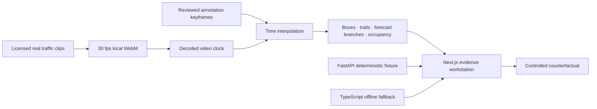

# Vector Field — Real-World Motion Evidence Lab

[](https://marinjursic.github.io/autonomous-motion-forecasting-lab/)
[](https://github.com/MarinJursic/autonomous-motion-forecasting-lab/actions/workflows/pages.yml)

Vector Field is a footage-first laboratory for reviewing motion tracks, multimodal forecasts, occupancy risk, visibility, calibration fixtures, and controlled counterfactuals. The default experience uses locally bundled, licensed real traffic video—not low-poly vehicles or a synthetic road scene.

> **Research interface, not a driving system.** The clips are real, while the reviewed boxes and tracks are demonstration annotations created for this repository. Forecast probabilities and metrics come from an auditable deterministic fixture, not a trained or safety-validated production model.

## Continuous application walkthrough

[](docs/walkthrough/app-walkthrough.mp4)

[Open the full-resolution MP4](docs/walkthrough/app-walkthrough.mp4) · [Open the poster frame](docs/walkthrough/app-walkthrough-poster.jpg)

The walkthrough is one continuous recording of the running application. It reviews
an aligned Gaithersburg actor while the source clip plays, runs a seeded
visibility counterfactual, changes an evidence layer, moves through all three
real-world scenarios, and demonstrates both themes. The footage plays continuously
rather than being replaced by concept renders or spliced mock screens.

## Three real-world scenarios

| Scenario | What it shows | Source and license |
|---|---|---|
| **MD-355 / MD-124, Gaithersburg** | Fixed elevated four-way intersection, daylight, dense cross traffic | G. Edward Johnson · [CC BY 4.0](https://commons.wikimedia.org/wiki/File:MD-355_and_MD-124_Gaithersburg_MD_2022-07-30_11-07-03_1.webm) |
| **Market Street, San Francisco** | Dense transit corridor with buses, cars, and a cyclist | Editor · [CC BY 3.0](https://commons.wikimedia.org/wiki/File:Street_traffic.webm) |
| **Cologne, Germany** | Low-light signal approach with reviewed vehicle movements | Maximilian Schönherr · [CC BY-SA 4.0](https://commons.wikimedia.org/wiki/File:Cars_Passing_by_at_Night.webm) |

Each source was trimmed, resized to 1280×720, transcoded to a local 30 fps VP9 WebM, and paired with an HD poster. No cars, cyclists, buildings, or background content were generated or composited. Full attribution and transformation notes are in [THIRD_PARTY_NOTICES.md](THIRD_PARTY_NOTICES.md).

Every checked-in track must remain attached to one visually identifiable road user across its full annotation window. The review pass intentionally removed a false Cologne cyclist track—the visible cargo bike was parked—and a Gaithersburg SUV track that crossed unrelated vehicles.

## How the app works

The center viewport is the evidence source of truth. `requestVideoFrameCallback` reads the actual decoded video clock, and the app interpolates reviewed track keyframes against that time. Scrubbing, looping, pausing, and playback-speed changes therefore keep boxes, observed trails, forecast branches, occupancy rings, frame numbers, and the actor inspector synchronized.

### Evidence controls

- Switch among three real clips without leaving the review surface.
- Play, pause, scrub with 10 ms precision, and cycle through `0.5×`, `1×`, and `1.5×`.
- Select an actor in the frame or review rail; choosing an out-of-window actor seeks to its evidence interval.
- Toggle reviewed detections, observed trails, future branches, conflict occupancy, and the visibility field independently.
- Read frame number, active-track count, clip provenance, annotation confidence, and visibility context.
- Change between persistent dark and light themes with accessible focus states and responsive layouts.
- On narrow screens the evidence footage and transport appear before the review and forecast rails.

### Forecast controls

The selected actor receives three visual future modes:

| Mode | Display |
|---|---|
| Continue | Solid orange branch |
| Yield | Cyan dashed branch |
| Deviate | Violet dotted branch |

All branches begin at the same current-time track position. Their display is synchronized to the video and bounded to the reviewed annotation interval.

### Counterfactual

The controlled intervention changes one context variable:

```text
obstruction ∈ {present, shifted, removed}
```

The active real scenario ID, selected reviewed actor ID, and intervention are all sent to the evidence endpoint. The reviewed track, source footage, horizon, seed (`42`), and sample count (`128`) remain fixed. Running the intervention calls the FastAPI engine when available and uses the byte-for-byte matching deterministic TypeScript fallback otherwise. The response drives the displayed risk, visibility, and mode probabilities; it is not discarded or replaced with a hard-coded UI value. The footage itself never changes.

The app labels the result as a fixture. It does not imply that removing an obstruction from a mathematical scenario edits the real video or proves a safety outcome.

## Architecture



| Layer | Responsibility |
|---|---|
| `app/components/MotionLab.tsx` | Video clock, transport, layers, actor review, inspector, themes, counterfactual interaction |
| `app/lib/scenarios.ts` | Clip provenance, reviewed keyframes, bounded interpolation, observed and forecast paths |
| `app/lib/motion-domain.ts` | Typed API client, deterministic forecast and counterfactual fallback |
| `backend/app/engine.py` | Seeded multimodal allocation, covariance growth, risk fixture, synthetic metrics |
| `backend/app/schemas.py` | Strict Pydantic request/response contracts |
| `backend/app/adapters.py` | Validated normalized mapping seams for separately obtained Waymo or CARLA input |

## Run locally

Prerequisites: Node.js `22.13+` and Python `3.11+`.

```bash
npm install
python3 -m venv backend/.venv
backend/.venv/bin/python -m pip install -r backend/requirements.txt
```

Start the optional API:

```bash
npm run api
```

Start the web application in another terminal:

```bash
npm run dev
```

Open the URL printed by the development server. All video, track, layer, transport, scenario, source, and theme interactions work without the API. The counterfactual and evaluation panels use the matching local fixture when the API is unavailable.

## API

| Method | Path | Purpose |
|---|---|---|
| `GET` | `/health` | Readiness and active engine |
| `GET` | `/api/scenarios/{id}` | Typed actors, map features, and coordinate frame |
| `POST` | `/api/forecast` | Multimodal trajectories, covariance, entropy, OOD proxy, and risk fixture |
| `POST` | `/api/evidence-counterfactual` | Active real clip + reviewed actor + controlled visibility intervention |
| `POST` | `/api/counterfactual` | Coordinate-contract compatibility adapter used by non-footage tests |
| `GET` | `/api/metrics` | Synthetic calibration, accuracy, OOD, and latency fixtures with provenance |

Example counterfactual:

```bash
curl -s http://127.0.0.1:8000/api/evidence-counterfactual \
  -H 'content-type: application/json' \
  -d '{
    "scenario_id": "market",
    "actor_id": "cyc-12",
    "intervention": "removed",
    "horizon_s": 3,
    "samples": 128,
    "seed": 42
  }'
```

## Deterministic fixture

The bundled model remains intentionally inspectable:

1. a small interaction stage raises uncertainty near conflict and occlusion;
2. a seeded categorical sampler allocates the requested count across continue, yield, and deviate modes;
3. trajectories receive curvature, speed scaling, and time-growing covariance;
4. empirical frequencies are normalized into per-actor probabilities;
5. a documented logistic fixture combines crossing probability and visibility into a scenario watch score.

Python and TypeScript use the same unsigned 32-bit seeded generator and allocation rules. Identical inputs therefore return identical fixture outputs online and offline. Reproducibility is useful for interface and systems testing; it is not evidence of model accuracy.

## Verification

```bash
npm run verify
```

The complete gate covers:

- production application and worker build;
- strict TypeScript and ESLint checks;
- three local WebM files with valid EBML headers and 1280×720 posters;
- track interpolation boundaries and common-origin multimodal forecasts;
- synchronized video-clock, layer, timeline, source, theme, mobile-order, and counterfactual contracts;
- selected scenario/actor/intervention binding, deterministic browser/API parity, and HTTP error handling;
- FastAPI endpoints, schemas, OpenAPI, covariance, counterfactual recomputation, fixture provenance, and adapter validation.

The project currently includes twelve browser/domain contract tests and fifteen backend tests.

## Accuracy boundaries

- Real footage does not make the overlays benchmark ground truth. They are reviewed demonstration annotations.
- Synthetic evaluation cards are clearly labeled and must not be compared with published model results.
- The collision watch score is a transparent fixture, not a calibrated safety probability.
- OOD is an interaction/visibility proxy, not a validated detector.
- No control, planning, or actuation output is produced.
- The adapter seams validate normalized mappings but do not redistribute Waymo data or bundle a running CARLA client.
- Production use requires licensed data, evaluated perception and forecasting models, dataset split discipline, probability calibration, rare-event testing, and formal safety review.

## Research grounding

- Waymo, [Open Motion Dataset](https://waymo.com/open/about/)
- Waymo, [Large-scale interactive motion forecasting](https://waymo.com/research/large-scale-interactive-motion-forecasting-for-autonomous-driving--the-waymo-open-motion-dataset/)
- Waymo, [MotionDiffuser](https://waymo.com/research/motiondiffuser-controllable-multi-agent-motion-prediction-using-diffusion/)
- CARLA, [coordinate system documentation](https://carla.readthedocs.io/en/latest/coordinates/)
- FastAPI, [type-driven validation](https://fastapi.tiangolo.com/python-types/)
- MDN, [`requestVideoFrameCallback`](https://developer.mozilla.org/en-US/docs/Web/API/HTMLVideoElement/requestVideoFrameCallback)

## Repository map

```text
app/components/MotionLab.tsx  footage-first review workstation
app/lib/scenarios.ts          real clips, provenance, tracks, interpolation
app/lib/motion-domain.ts      typed fixture and API client
backend/app/                  FastAPI schema, engine, endpoints, adapters
public/scenarios/             three licensed real-world WebM clips and posters
docs/walkthrough/             continuous MP4, GIF preview, and poster
tests/                        video, interpolation, rendered-shell, and domain tests
THIRD_PARTY_NOTICES.md        media attribution and transformation record
```

The source code is governed by the repository license. Third-party traffic footage remains under the licenses recorded in [THIRD_PARTY_NOTICES.md](THIRD_PARTY_NOTICES.md).
